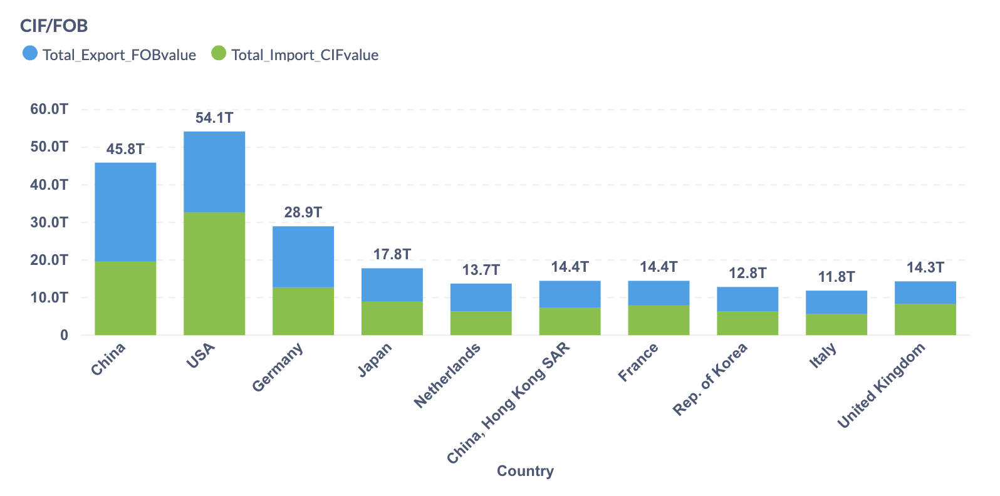
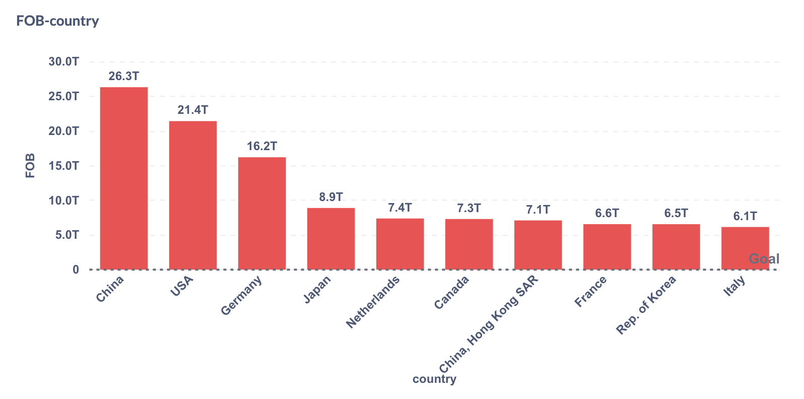
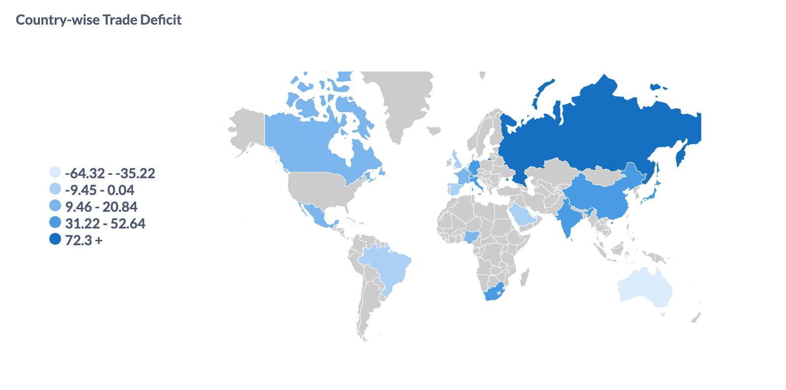
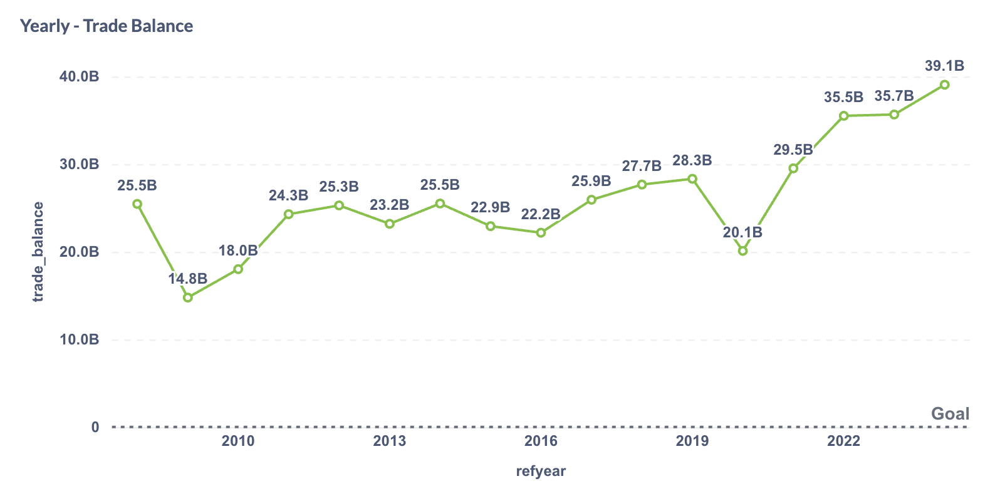

# README: Global Trade Analytics Project (Comtrade + MySQL + Metabase)

## 🌍 Project Overview

This project builds an end-to-end **global trade analytics system** using:

- **UN Comtrade trade data** (2008–2024, multi-country)
- **MySQL (Docker)** for storage
- **Metabase (Docker)** for visual dashboards
- **Python** for ETL and data ingestion

Our main goal is to analyze global trade patterns — including imports, exports, trade balance, FOB/CIF ratios, and partner country correlations — with an interactive and self-serve dashboard experience.

---

## ⚙️ System Architecture

```
[CSV Files from UN Comtrade]
        ↓
[Python ETL Script: load-to-sql.py]
        ↓
[MySQL Container (Docker)]
        ↓
[Metabase Container (Docker)]
        ↓
[Interactive Dashboards & SQL Analytics]
```

---

## 📦 Project Components

### 1. **Data Ingestion (Python)**

Script: `load-to-sql.py`

- Connects to local Dockerized MySQL
- Loads cleaned CSVs into `trade_summary` table
- Handles fields: country, year, imports, exports, CIF/FOB, etc.

### 2. **Database Setup**

Docker container exposes MySQL on `localhost:3306` with:

```sql
CREATE DATABASE trade_db;
CREATE TABLE trade_summary (...);
```

### 3. **Metabase Dashboards**

Connected to MySQL via Docker network. Exposes interactive dashboards using the following charts:

---

## 📊 Dashboard Visualizations

### 1. **CIF vs FOB Value by Country**

**Query:**

```sql
SELECT * FROM (
  SELECT
    reporterdesc AS Country,
    SUM(CASE WHEN flowcode = 'M' THEN cifvalue ELSE 0 END) AS Total_Import_CIFvalue,
    SUM(CASE WHEN flowcode = 'X' THEN fobvalue ELSE 0 END) AS Total_Export_FOBvalue
  FROM trade_summary
  GROUP BY reporterdesc
  ORDER BY Total_Export_FOBvalue DESC
) q1
WHERE q1.Total_Import_CIFvalue > 0
LIMIT 10;
```

**Chart Type:** Grouped bar chart

### 2. **Top Exporters by FOB Value**

**Query:**

```sql
SELECT reporterdesc AS country, SUM(fobvalue) AS FOB
FROM trade_summary
WHERE flowcode = 'X'
GROUP BY reporterdesc
ORDER BY FOB DESC
LIMIT 10;
```

**Chart Type:** Bar chart

### 3. **Trade Deficit % by Partner (USA 2024)**

**Query:**

```sql
SELECT
  partnerdesc,
  SUM(CASE WHEN flowcode = 'M' THEN cifvalue ELSE 0 END) AS total_imports,
  SUM(CASE WHEN flowcode = 'X' THEN fobvalue ELSE 0 END) AS total_exports,
  ROUND(
    (SUM(CASE WHEN flowcode = 'M' THEN cifvalue ELSE 0 END) -
     SUM(CASE WHEN flowcode = 'X' THEN fobvalue ELSE 0 END)) * 100.0 /
    NULLIF(
     SUM(CASE WHEN flowcode = 'M' THEN cifvalue ELSE 0 END) +
     SUM(CASE WHEN flowcode = 'X' THEN fobvalue ELSE 0 END), 0), 2
  ) AS trade_deficit_percent
FROM trade_summary
WHERE reporterdesc = 'USA' AND refyear = 2024
GROUP BY partnerdesc
ORDER BY trade_deficit_percent DESC;
```

**Chart Type:** Choropleth Map (country color based on deficit %)

### 4. **Yearly Trade Balance (India → USA)**

**Query:**

```sql
SELECT
  reporterdesc,
  refyear,
  partnerdesc,
  SUM(fobvalue) - SUM(cifvalue) AS trade_balance
FROM trade_summary
WHERE reporterdesc = 'India' AND partnerdesc = 'USA'
GROUP BY reporterdesc, refyear, partnerdesc
ORDER BY reporterdesc, refyear, trade_balance DESC;
```

**Chart Type:** Line chart

---

## 📁 Deployment Instructions

### Step 1: Start MySQL and Metabase with Docker Compose

```bash
docker-compose up -d
```

Example `docker-compose.yml` includes:

- MySQL (with `--local-infile=1`)
- Metabase (connected to MySQL via Docker network)

### Step 2: Run the Python Loader Script

```bash
python load-to-sql.py
```

This loads the cleaned dataset into the MySQL table.

### Step 3: Log into Metabase (http://localhost:3000)

- Connect to `trade_db`
- Create cards using the queries above
- Add dropdown filters for `refyear`, `reporterdesc` as needed

---

## 🖼️ Sample Outputs (as shown in dashboard)

### ✅ CIF vs FOB by Country



### ✅ Top Exporting Countries



### ✅ Country-wise Trade Deficit % (Map)



### ✅ Yearly Trade Balance (India → USA)



---

## 📌 Next Steps

- Add `dbt` models for layered transformation
- Automate monthly data ingestion
- Build alerts in Metabase for sudden trade shifts

---

## 🧠 Author Notes

- All trade data sourced from [UN Comtrade+](https://comtradeplus.un.org/)
- Hosted entirely on Docker for reproducibility

Feel free to fork this project and scale it for deeper country-to-country trade insights.
